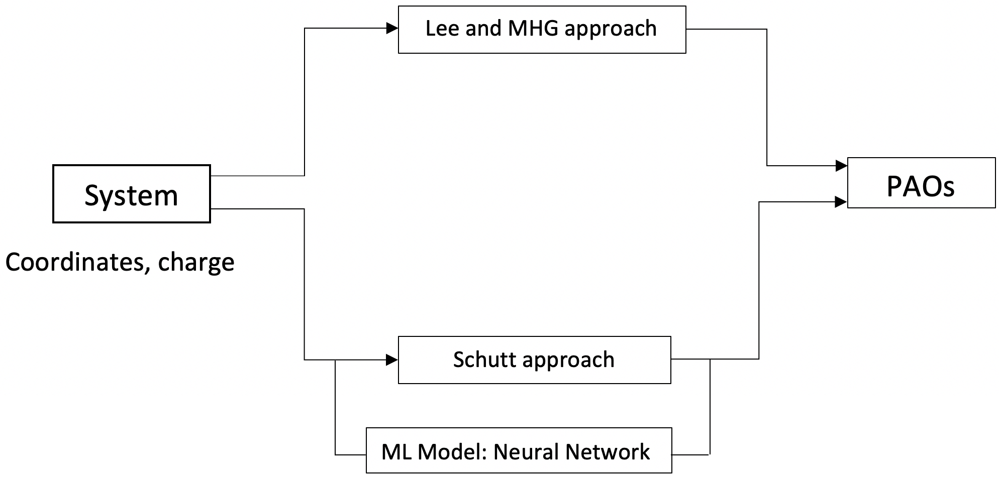
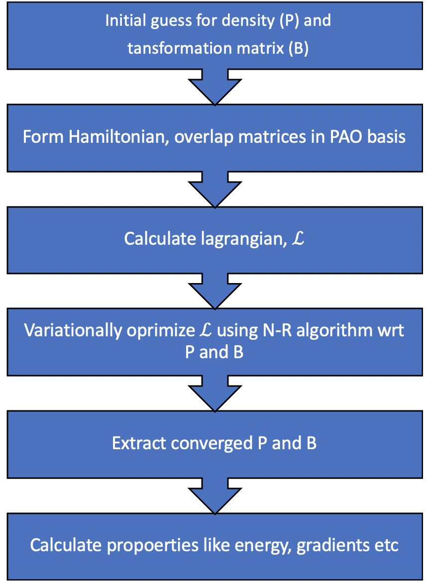
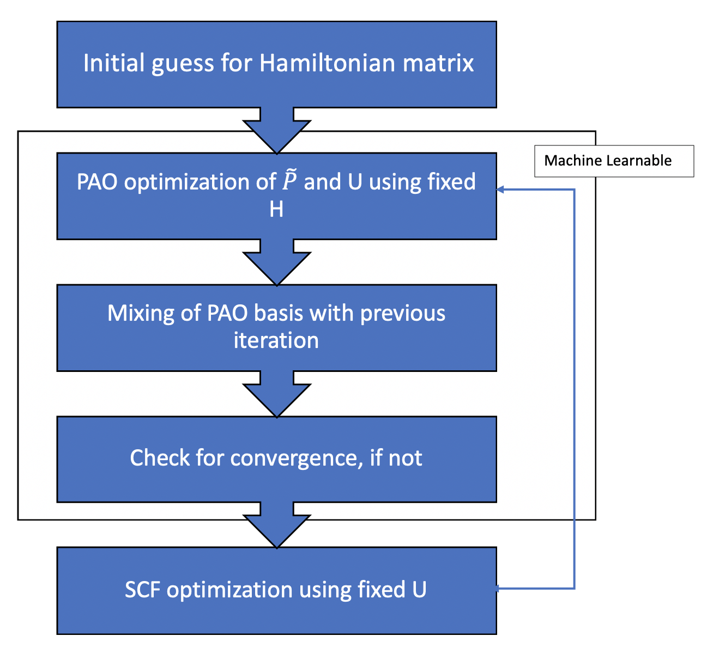

# CSCI596_FINAL

## A new approach towards implemntation of polarized atomic orbitals in Q-Chem using neural networks

The application of electronic structure calculations to bigger systems is limited by their scaling with the number of basis functions. However, the pitfalls of using smaller basis sets are well documented, especially in variational methods. 

In this work we introduce polarized atomic orbitals which have the same size as a minimal basis set, but are formed from the atom centered linear combination of a bigger basis. The transformation is designed such that the smaller PAO basis is distorted in a suitable way to reflect the system's environment, and so the smaller basis does not lose the flexibility afforded by the bigger basis set. PAOs were first introduced by Lee and Head-Gordon and their implementation is currently used in Q-Chem. But, Lee and Head-Gordon's approach does a complex optimzation calculation to get PAOs which makes it unsuitable for application in dynamics. 

Here we introduce another approach towards obtaining PAOs that was initially proposed by Schutt and VandeVondele which can be coupled with a machine learning model. We propose to implement this scheme in Q-Chem where a neural network can take over the work of performnig the optimization and we can apply our method to study dynamics of bigger systems. 

We suggest multiple test systems for benchmarking our approach against Lee and Head-Gordon's approach, and several potential applications in bio-molecule and nanoparticle stidues are discussed as well. 

### Lee and MHG Approach
{:height="50%" width="50%"}

### Schutt Approach
{:height="50%" width="50%"}

#### References
1. [Lee and Head-Gordon's approach](https://aip.scitation.org/doi/10.1063/1.475199)
2. [Schutt's approach](https://pubs.acs.org/doi/abs/10.1021/acs.jctc.8b00378)
3. [Machine learning in quantum chemistry](https://pubs.acs.org/doi/10.1021/acs.jpclett.9b03664)
